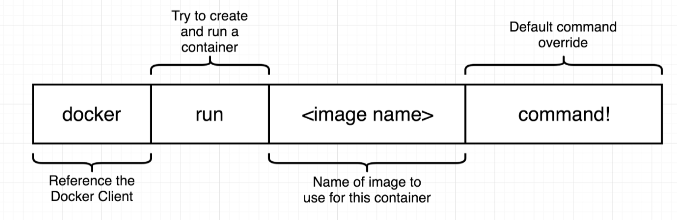
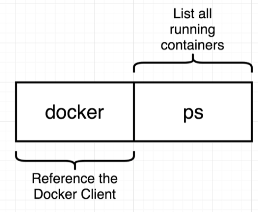
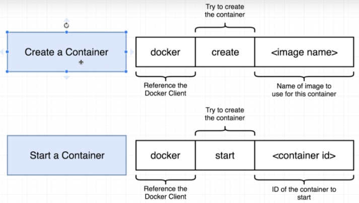
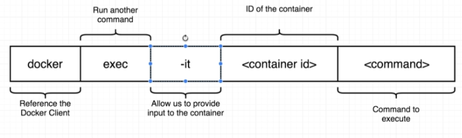
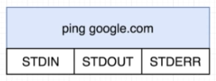

# Manipulating containers with docker client

## How does docker runs on a computer

Docker is a linux VM, so it present some linux specific features like:
- Namespacing: Isolating resources per process (or group of precesses)
- Control groups (cgroups): Limit the amount of resources used per process

Creating and running a container from an image: `docker run {image_name}`

eg: `docker run busybox echo bye world`

## Listing running containers

`docker ps`

`docker ps --all` "-a" or "--all" would list all the containers ever created on our machine

## Container lifecycle

`docker run {image_name}` = `docker create {image_name}` + `docker start {image_name}` 

creating: preparing the file system

starting: running the startup command

## Deleting unused data

`docker system prune`

## Get emited logs from container

`docker logs {container_id}` get a record of all the logs emited by the container since it has been started

## Stopping containers

`docker stop {container_id}` stop a container (stop with a cleanup period)

`docker kill {container_id}` kill a container (instant stop)

## Multi-command containers

For instance if we want to acess the redis cli, we would need to run both `redis run sever` and `redis-cli` commands in the same container

For that we can execute additionnal commands in running containers:

First start the container with `docker run redis`

Then `docker exec -it {container_id} redis-cli`

### The purpose of the `-it` flag

Since docker is a "Linux virtual machine" it's running with "STDIN", "STDOUT" and "STDERR" channels. 

- The `-i` has the purpose of connecting to the "STDIN" channel 
- The `t` flag has the purpose of formating our output

## Using the shell

### Opening a shell in a running container

Get full terminal access of the running container: `docker exec -it {container_id} sh`

To exit it use either `CTRL + C` or `CTRL + D`

### Starting a container with a shell

Run an image and get the terminal access of it: `docker run -it {image_name} sh`

