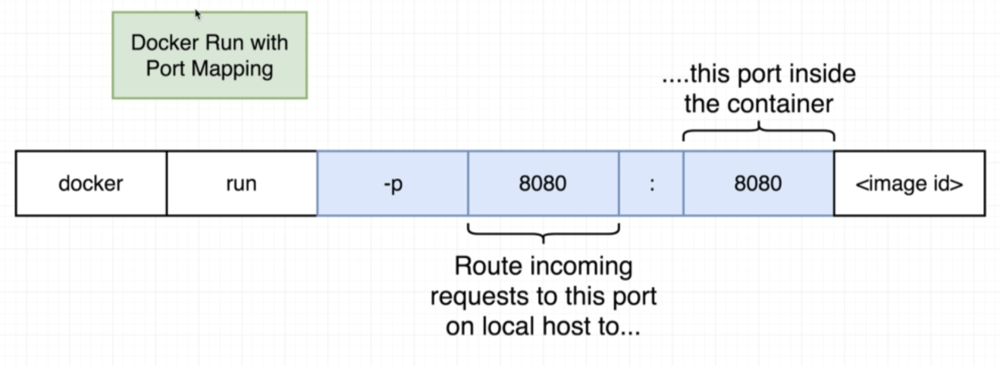

# Making real projects with docker

## Node setup

Steps:
- Create Node Js web app
- Create a Dockerfile
- Build image from Dockerfile
- Run image as containerr
- Connect to web app from a browser

For the example project files see [this folder](https://github.com/ClemSau/docker-and-kubernetes-course-notes/examples/section_4/simpleweb)

Some takeways from this sections are:
- Using a community image as a base of our own image is prefered
- The alpine version of the images is the minimal one (no extra softwares)
- The extra files we want in our image must be added manually (with the `WORKDIR` and `COPY` keywords)

## Port mapping

In order to allow external network to access the conterner's intern network and make requests, we need to map the ports accordingly

